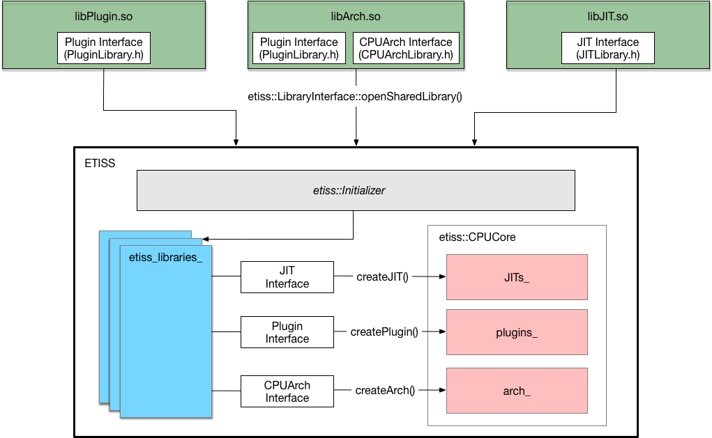

# ETISS (Extendable Translating Instruction Set Simulator)

ETISS is a C++ ISS (Instruction Set Simulator), which is designed to
simulate instructions for a target core on a host computer. It translates
binary instructions into C code and appends translated code into a block,
which will be compiled and executed at runtime. As aforementioned, it is
Extendable, thus it supports myriad level of customization by adopting the
technique of plug-ins. ETISS supports varied **Instruction Set Architectures
(ISAs)** according to user needs (see architecture models in `ArchImpl/`).
Meanwhile, the simulator could be enhanced with customized plug-ins to set
up many applications (see application examples in `examples/`).

  

ETISS is structured as shown in the diagram above, and it is capable of
translating binary instructions according to loaded architecture models.
Furthermore, plug-ins could be developed to model new features of architecture
and be added flexibly without any hacking in the ETISS source code.

## Getting Started

ETISS has to be built into separate libraries, and a main file is needed
to set up a simulator. After build and installation, the folder `examples/`
will be installed into `<etiss_install_dir>` with correct
configuration. Check `README` in `<etiss_install_dir>/examples/` respectively
to set up a simulator for varied bare-metal simulations.

### System Requirements

ETISS is supported on x86_64 Linux and Windows hosts. Tested compilers include GCC 7.4 and MSVC 2019. CMake 3.13 is required as build system.

### Dependencies

  - GCC Compiler >= 5.0
  - Boost >= 1.54
  - Graphviz + Doxygen (For documentation generation)
  - LLVM + Clang 7 (Please download appropriate pre-built binaries from https://releases.llvm.org/download.html)

Packages for Ubuntu 18:

    sudo apt-get install g++ libboost-system-dev libboost-filesystem-dev libboost-program-options-dev graphviz doxygen libtinfo-dev zlib1g-dev texinfo

If LLVM-JIT is used:

	sudo apt-get install gcc-multilib

### Build and Installation

Follow these instructions to quickly build ETISS. Start in the root directory of ETISS by creating a build directory:

	$ mkdir build_dir

Change to the created directory, e.g.,

	$ cd build_dir

If LLVM-JIT compiler is used, source it with the environment variable:

	$ export LLVM_DIR=/path/to/llvm

Configure the build system, e.g.,
Replace `` `pwd`/installed`` with your `<etiss_install_path>` if you do not like to install etiss into `build_dir/installed/`. Set up path to cmake if necessary.

	$ cmake -DCMAKE_BUILD_TYPE=Release -DETISS_BUILD_MANUAL_DOC=ON \
	        -DCMAKE_INSTALL_PREFIX:PATH=`pwd`/installed \
	        ..

Compile the package:

	$ make

Build the documentation (optional):

	$ make doc

Install the package:

	$ make install

## Example project to run etiss

Follow steps in `<etiss_install_path>/examples/README`

## Licensing and Copyright

See the separate `LICENSE` file to determine your rights and responsibilities
for using ETISS.

## User Documentation

The documentation is optionally built with ETISS and can be found in `<etiss_install_path>/doc/html/index.html`

It is also hosted at https://tum-ei-eda.github.io/etiss/
