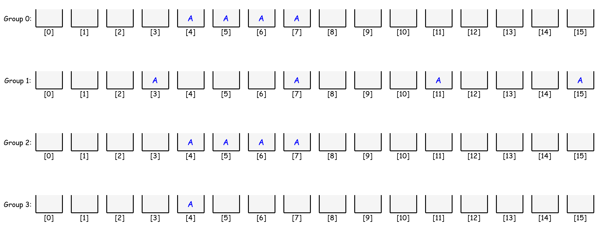
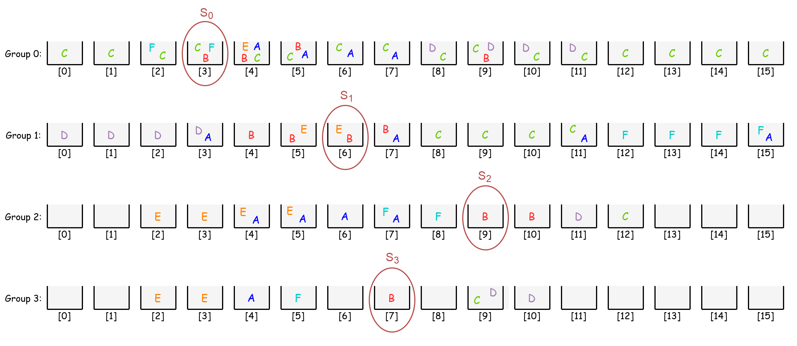

Decoding Algorithm {#decodealgo}
==================

The most basic concept of the decoding algorithm can be summarized as follows:

```python
for instr in all_instructions_in_cache:
    if instr.mask and incoming_bit_array == instr.opcode:
        return instr
```

where the fetched bit array needs to match the opcode of one of the instruction in the cache. However, this is a linear search and has a time complexity of O(N), hence running slowly.  In order to boost the performance, a tree-based search can be deployed. One method is to split the bit array into small code chunks and based on the numbers that code chunks are being evaluated, the tree can be constructed.

As an example, a 16-bit instruction ``A`` has the following encoding pattern:

A_{encoding} = 010001 :: imm[3:0] :: 1101 :: d[1:0]$$</p>

where ``imm`` is the immediate value and ``d`` is the index of the destination register both of which can take any value. The other bits are fixed and identify the instruction and they are called opcode. The mask **1111110000111100** can be used to filter out the bits other than the opcode. From the opcode point of view, instruction ``A`` can be represented as:

$$A_{opcode} = 010001 :: XXXX :: 1101 :: XX$$

where ``X`` is don’t care bit. After splitting encoding of the instruction ``A`` into small chunks of 4-bits we get four groups:

$$
 A =
\\underbrace{0100}\_{\\substack{\\text{Group 3} \\\\ \\text{value of 4}}} ::
\\underbrace{01XX}\_{\\substack{\\text{Group 2 permutated:} \\\\ \\text{0100 value of 4} \\\\ \\text{0101 value of 5} \\\\ \\text{0110 value of 6} \\\\ \\text{0111 value of 7} }} ::
\\underbrace{XX11}\_{\\substack{\\text{Group 1 permutated:} \\\\ \\text{0011 value of 3} \\\\ \\text{0111 value of 7} \\\\ \\text{1011 value of 11} \\\\ \\text{1111 value of 15} }} ::
\\underbrace{01XX}\_{\\substack{\\text{Group 0 permutated:} \\\\ \\text{0100 value of 4} \\\\ \\text{0101 value of 5} \\\\ \\text{0110 value of 6} \\\\ \\text{0111 value of 7} }}
$$

where don’t care bits are permutated as they can take any value, and obviously a chunk can have $2^4$ permutation at most. Now, the chunks of instruction ``A`` should be placed to associated nodes at each group according to the value that the chunk can take as follows:

<center>  </center>

each group represents an array with $2^N$ nodes where each node is a set of instruction pointers. In other words, a node (or bucket) is of type ```std::set<Instruction*>``` whereas a group is an array of nodes and is of type ```Node*```. As explained, the chunk value determines the index number the chunk is going to be assigned.

After all modeled instructions are assigned to the associated nodes, the initialization phase is completed. In the decoding phase during simulation, a fetched bit array should be resolved to identify which instruction to be executed. The decoding algorithm starts with dividing the bit array into chunks. After, it labels the associated nodes at each group based on the chunk values. The intersection of the labeled nodes gives the instruction.

As an example, suppose 16-bit **0111100101100011** is fetched from the memory. The decoding algorithm will split it into four chunks as follows:

$$fetched \\: bit \\: array =
\\underbrace{0111}\_{\\substack{\\text{Group 3:} \\\\ \\text{value of 7}}} ::
\\underbrace{1001}\_{\\substack{\\text{Group 2:} \\\\ \\text{value of 9}}} ::
\\underbrace{0110}\_{\\substack{\\text{Group 1:} \\\\ \\text{value of 6}}} ::
\\underbrace{0011}\_{\\substack{\\text{Group 0:} \\\\ \\text{value of 3}}}
$$

subsequently, 3<sup>rd</sup> node in Group 0, 6<sup>th</sup> node in Group 1, 9<sup>th</sup> node in Group 2, and 7<sup>th</sup> node in Group 3 are marked as follows:

<center>  </center>

lastly, intersection of these sets S0 ∩ S1 ∩ S2 ∩ S3 will give the instruction ``B``. So, the decoding algorithm successfully resolved the fetched bit array.