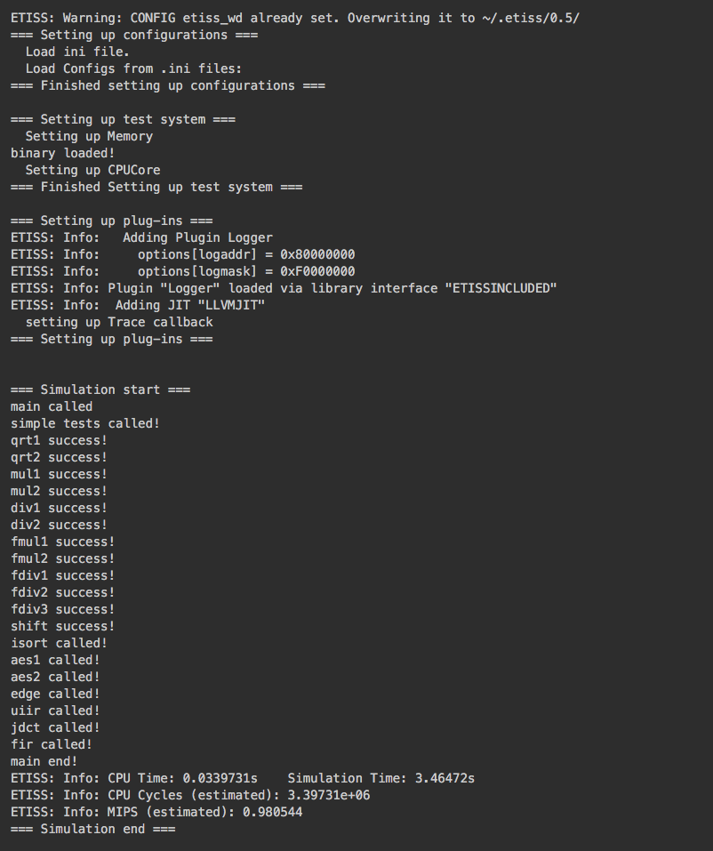

# Bare-Metal Simulation

This folder contains a basic example project that uses ETISS.

The corresponding target software must firstly be build for the core. These
can be found in SW subdirectory of the `examples` directory. When simulation
running, the ETISS will translate compiled binary code into host executable
code and simulate the behavior of target bare-metal core.

## Getting Started

Check the file `./ETISS.ini` to select desired architecture and plug-in
to simulate. Target software path should be explicitly given for
**sw_binary**. Also, other configuration options of ETISS are available
in this file (e.g. logger severity level).

Check README in `../SW` to assure all prerequisites are fullfilled (e.g.
setting up path to toolchain, getting required libraries, ...).

After checking all prerequisites, execute the following commands to build
the example software:

	$ cd ../SW/<or1k>|<riscv>/
	$ make

Finally we can build and run the simulation with the following script:

	$ ./run.sh

  > NOTE: This script simply adds environment variables, creates the build
  subdirectory, executes cmake, then make and starts the main executable
  with ETISS.ini as parameter.
  > Note: To allow the execution of run.sh, you might need to run the following command first:
  chmod +x run.sh

## Debugging

### Debug ETISS
`./run.sh` could be easily modified to use GDB. To replace following line:

	./build/main -iETISS.ini

with

	gdb --args ./build/main -iETISS.ini
then run it in terminal.

### Debug target software
A **gdbserver** is integrated in ETISS, and it could be used to debug target
core when it runs target SW. The gdbserver could be enabled by configure
options in `./ETISS.ini` with this configuration:

	[Plugin gdbserver];
		port=<port_number_you_defined>
		minPcAlign=<minimal_instruction_bits_alignment>

The gdbserver surveilles undelying target SW, send/recieve commands
to/from target core. The ETISS simulation will be suspended at the
beginning of target SW, waiting for incoming command, if **gdbserver**
is enabled.

#### Use gdbserver
Run the ETISS (main) using aformentioned script, then invoke corresponding
gdb in a new terminal. E.g. or1k-elf-gdb for or1k core. **Do not use system
default gdb directly for target core.** The target SW executable should be
given as an argument or given after entering gdb and using file command.
The executable is used to load symbol table. For example:

	$ <target_toolchain>-elf-gdb <SW_directory>/<target_SW>.elf

alternative:

	$ <target_toolchain>-elf-gdb
	$ (gdb) file <SW_directory>/<target_SW>.elf

Then you should connect gdb to gdbserver inside ETISS

	$ (gdb) target remote :<port_number_you_defined>  //local computer

or:

	$ (gdb) target remote <host_ip>:<port_number_you_defined>  // connect through internet to remote computer

As connection between gdb and gdbserver is established, standard gdb command
could be used to debug target SW.

  > RSP protocal commands (internal gdb commands) such as 'g', 'G'
  for read/write all registers, are invisible for gdb user. These commands
  cannot be recognized by gdb.

## Snapshot

the output during execution should look similar to this:

### GDB output in terminal
When utilizing **gdbserver** to debug target software.

### ETISS output in terminal

