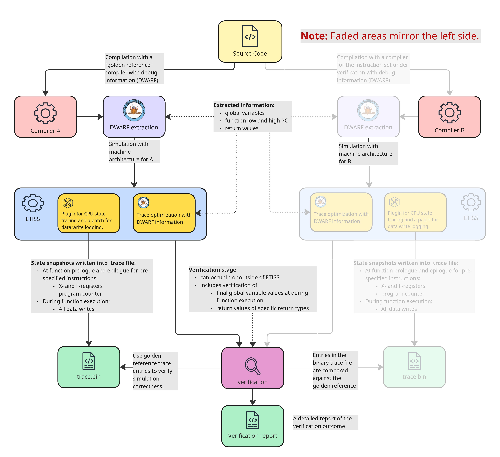
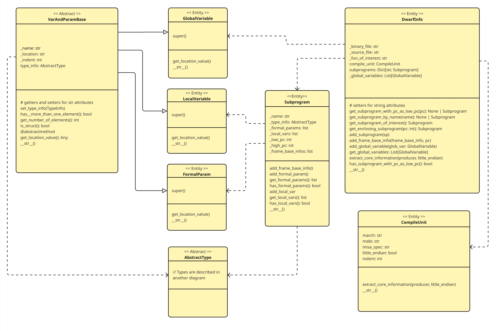
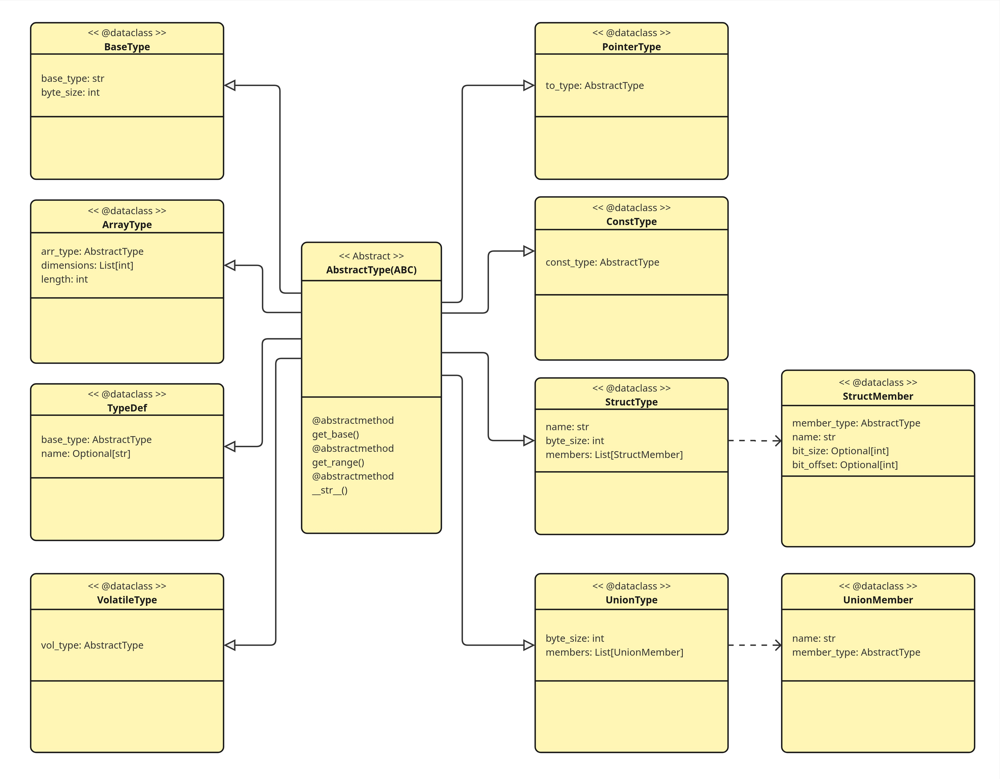
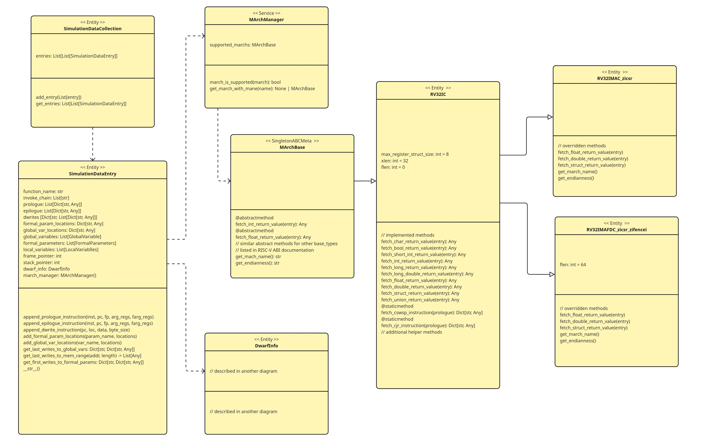

# Technical doumentation

The purpose of this documentation is to provide  a brief introduction to the technical implementation of the verification pipeline. The main intended audience are the software engineers continuing the development of this project. 

For more information, please see Heidi Holappa's Master's thesis on ETISS-GTS: http://hdl.handle.net/10138/602402

## Overview

The trace-based verification is based on the comparison of traces from a "golden reference" and an "instruction set under verification". The assumption here is that the "golden reference" behaves correctly and any discrepancies in the traced values would then suggests an anomaly in the behavior of the "instruction set under verification". Both binaries share the same source code. The source code is then compiled to two different architectures with **debug information and no optimizations**. After this the pipeline execution starts. The example script in `README.md` provides a list of all the information the pipeline requires to execute.  

The pipeline executes the following stages:
1. selected DWARF debug information is extraced from both binaries
2. ETISS simulation is executed on both binaries. During simulation, traces of CPU snapshots and data writes are collected. Traces are stored to disk.
3. Using DWARF debug information as a bridge the trace outputs are then compared to detect any anomalies
4. Finally, the pipeline outputs a log both into the console output and into a file.

# DWARF extraction

ETISS-GTS verification pipeline uses pyelftools as a dependency to extract DWARF debug information. The pyelftools out-of-the-box provides all extraction functionalities that were required for this proof-of-concept. Nevertheless, it took quite a bit of code to extract the required infromation and to structure it in a useful way. 

As a first step, the metadata is extracted from the DWARF and ELF metadata. As the proof-of-concept only supports extraction from a single Compilation Unit (CU), next the CU for the sought source file is located. From here, the top DIEs are extracted and for each top DIE, all child DIEs required by the verification pipeline are also extracted. During extraction variables and parameters are recursively extracted by using the type composition.    

## Code structure 

Currently, the pipeline supports extracting DWARF debug information from a single Compilation Unit (CU). In future work the constraint should be lifted by introducting support for multiple CUs. The code structure follows the principles of object-oriented programming. The class `DwarfInfo` is the top most object instance through which all other object instances can be accessed. The DWARF info contains information on the selected Compilation Unit (which here is one of the source files), on subprograms in the source file and of the global variables in the source file. Similarily the subprograms again contain the informaiton on the formal parameters and local variables of the given subprogram. 

The DWARF data types are built using type composition. The implementation of the types in the verification pipeline follows a similar logic. Most types here inherit class AbstracType that defines methods all classes extending it should implement. Here, abstract classes are in this manner similar to interfaces in many other languages. Types other than base_type have a reference to an `AbstractType`, which as a kind of interface represents a contract that a class extending it is the reference, mimicking the type composition used in DWARF structure.    

The extracted traces are used to create simulation data entries. A new entry is formed for each invoked function. Each `SimulationDataEntry` references the `DwarfInfo` instance and additionally `MArchManager`, which provides information on the specific machine architecture. As of now the only supported machine architecture is `RV32IC`. It acts as a parent class for `RI32IMAC` and `RV32IMACFD` that override methods or implement abstract methods defined in `RV32IC` to comply with how these functionalities should behave in the given architecture based on the RISC-V ABI (Application Binary Interface). These methods are then used to verify the extracted traces from return values and data writes to global variables.   

