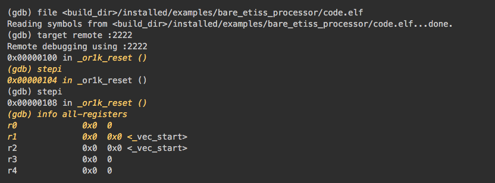

# Bare-Metal Simulation

This folder contains a basic example project that uses ETISS.

The corresponding target software must firstly be build for the core. These
can be found in SW subdirectory of the `examples` directory. When simulation
running, the ETISS will translate compiled binary code into host executable
code and simulate the behavior of target bare-metal core.

## Getting Started

Check the file `./ETISS.ini` to select desired architecture and plug-in
to simulate. Target software path should be explicitly given for
**sw_binary**. Also, other configuration options of ETISS are available
in this file (e.g. logger severity level).

Check README in `../SW` to assure all prerequisites are fullfilled (e.g.
setting up path to toolchain, getting required libraries, ...). You also
find the detailed instructrions to compile SW in respective directories

After checking all prerequisites, execute the following commands to build
the example software:

	$ cd ../SW/<or1k>|<riscv>/
	$ mkdir build && cd build
	$ cmake ..

### LINUX SYSTEM

	$ make

After SW compilation, we can build and run the simulation with the following script:

	$ ./run_helper.sh path/to/target/binary

  > NOTE: This script simply adds environment variables and starts the main executable
  with ETISS.ini as parameter.

### WINDOWS SYSTEM

	$ cmake --build . --config $BUILD_TYPE

Set the PATH variable to include files in the build/installed/lib/ folder and then run the program by passing required architecture, jit and plugins. An example is shown here. Please use --help to display all configurations supported.

	$ $Env:Path="X:/path/to/lib;"+$Env:Path
	$ cd build/$BUILD_TYPE

  > NOTE: $BUILD_TYPE is either Release or Debug depending on how it was compiled.)

	$ main --vp.elf_file=X:/path/to/build/installed/examples/SW/riscv/build/riscv_example --arch.cpu=RISCV --jit.type=TCCJIT --etiss.loglevel=4 -pLogger

## Debugging

### Debug ETISS

	./run_helper.sh ELFFILE gdb

### Debug target software
A **gdbserver** is integrated in ETISS, and it could be used to debug target
core when it runs target SW. The gdbserver could be enabled by configure
options in `./ETISS.ini` with this configuration:

	[Plugin gdbserver];
		plugin.gdbserver.port=<port_number_you_defined>
		minPcAlign=<minimal_instruction_bits_alignment>

The gdbserver surveilles undelying target SW, send/recieve commands
to/from target core. The ETISS simulation will be suspended at the
beginning of target SW, waiting for incoming command, if **gdbserver**
is enabled.

#### Use gdbserver

Short version:

	./run_helper.sh ELFFILE tgdb

Requires KDE "Konsole", but add option "noattach" to attach to the gdbserver manually (see below).

Long version:

Run the ETISS (main) using aformentioned script, then invoke corresponding
gdb in a new terminal. E.g. or1k-elf-gdb for or1k core. **Do not use system
default gdb directly for target core.** The target SW executable should be
given as an argument or given after entering gdb and using file command.
The executable is used to load symbol table. For example:

	$ <target_toolchain>-elf-gdb <SW_directory>/<target_SW>.elf

alternative:

	$ <target_toolchain>-elf-gdb
	$ (gdb) file <SW_directory>/<target_SW>.elf

Then you should connect gdb to gdbserver inside ETISS

	$ (gdb) target remote :<port_number_you_defined>  //local computer

or:

	$ (gdb) target remote <host_ip>:<port_number_you_defined>  // connect through internet to remote computer

As connection between gdb and gdbserver is established, standard gdb command
could be used to debug target SW.

  > RSP protocal commands (internal gdb commands) such as 'g', 'G'
  for read/write all registers, are invisible for gdb user. These commands
  cannot be recognized by gdb.

#### Using an IDE for debugging

As long as the IDE supports remote debugging with GDB, it will be able to connect to the GDBServer of ETISS.

##### Eclipse

For example use the following steps to debug with Eclipse (https://stackoverflow.com/a/45608937):

Setup:

- Get "Eclipse IDE for C/C++ Developers"
- Open Eclipse
- Menu: Run -> Debug Configurations...
- Select: C/C++ Remote Application
- Press "New Configuration" button on top
- At the bottom click on "Select other..."
- Check: Use configuration specific settings
- Select: GDB (DSF) Manual Remote Debugging Launcher
- Main tab: Enter C/C++ Application path
- Debugger tab -> Main sub-tab: Enter toolchain GDB path into "GDB debugger"
- Debugger tab -> Connection sub-tab: TCP, localhost, 2222
- Click Apply, Close

Usage:

- Run ETISS with GDBServer enabled
- Menu: Run -> Debug

##### Visual Studio Code

Create a new debugging configuration for your project by going to the debug side-view on the left. Click on the drop-down, select "Add Config (your project name)", select environment "C++ (GDB/LLDB)". Adjust the file that opens like the following:

	{
		// Use IntelliSense to learn about possible attributes.
		// Hover to view descriptions of existing attributes.
		// For more information, visit: https://go.microsoft.com/fwlink/?linkid=830387
		"version": "0.2.0",
		"configurations": [
			{
				"name": "ETISS Debug",
				"type": "cppdbg",
				"request": "launch",
				"program": "${workspaceFolder}/target_sw/bin/target_binary.elf",
				"miDebuggerServerAddress": "localhost:2222",
				"args": [],
				"stopAtEntry": false,
				"cwd": "${workspaceFolder}",
				"environment": [],
				"externalConsole": false,
				"MIMode": "gdb",
				"setupCommands": [
					{
						"description": "Enable pretty-printing for gdb",
						"text": "-enable-pretty-printing",
						"ignoreFailures": true
					}
				],
				"miDebuggerPath": "/usr/local/research/projects/SystemDesign/tools/riscv/current/bin/riscv32-unknown-elf-gdb"
			}
		]
	}

## Snapshot

The output during execution should look similar to this:

### GDB output in terminal
When utilizing **gdbserver** to debug target software.

### ETISS output in terminal

